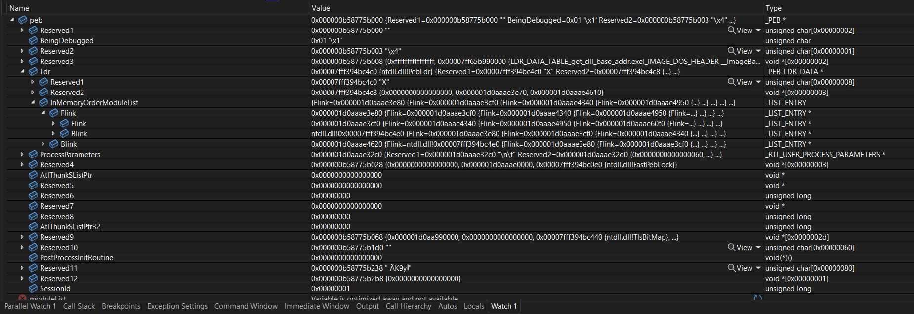

# M_GetModuleHandleA
Custom low-level Assembly implementation of WinAPI function GetModuleHandle().

## Why
In theory, this **could** fly below Windows `Exploit Guard` and similar `WinAPI Monitoring` techniques.  
However, due to **COMPLETE LACK OF RESOURCES AND SUPPORT** we can't test if it really does. 

Further infos on the topic in general:
- Def Con 32: https://www.youtube.com/watch?v=cHsRxkfxvq8
- VERGILIUS:  https://www.vergiliusproject.com/kernels/x64/windows-10/22h2/_PEB_LDR_DATA
  
## Usage Guidelines
This is an *Informational Article* in the area of Security Research, intended as baseline- and study guideline, and not a finished product. You are free to use the information to create your own version, but: 

*"Please, **do not use our code as-is** in production, your own RedTeam or Pentesting activity, CTFs or malicious activity."* 

We spend a lot of time on creating things like this, with the intention to use the code for our own, legal RedTeam activities, and to share the information with the community. Would be great, if it still works when we use it **for the first time** and not instantly be flagged. 

For the very least, **add some obfuscation**, other instructions, not just NOPs!

If your skill level doesn't allow for that - maybe you shouldn't do these things in the first place and consider methods you understand instead. Like, riding your tricycle, or playing hide & seek. 

Thank you.

## Threat Information Block
and special registers. 

https://en.wikipedia.org/wiki/Win32_Thread_Information_Block  


# 64bit Registers
### Architecture
| 64-bit                    ||||||||
|---------------------------|-|-|-|-|-|-|-|
| 32-bit         ||||32-bit |||
| 16-bit         ||16-bit||16-bit ||16-bit|
| 8-bit  | 8-bit | 8-bit  | 8-bit | 8-bit  | 8-bit | 8-bit  | 8-bit     |

### General-Purpose Registers (Classic)
| Register (64-bit) | Low 32-bit | Low 16-bit | Low 8-bit |
|-------------------|------------|------------|-----------|
| **RAX**           | EAX        | AX         | AL        |
| **RBX**           | EBX        | BX         | BL        |
| **RCX**           | ECX        | CX         | CL        |
| **RDX**           | EDX        | DX         | DL        |
| **RDI**           | EDI        | DI         | DIL       |
| **RSI**           | ESI        | SI         | SIL       |
| **RBP**           | EBP        | BP         | BPL       |
| **RSP**           | ESP        | SP         | SPL       |
| **R8**            | R8D        | R8W        | R8B       |

### SIMD (128-bit, 256-bit, 512-bit) and System Registers
| Register Type   | Naming    | Description                      |
|-----------------|-------------|----------------------------------|
| **XMM**         | XMM0-XMM15  | 128-bit for floating-point/SIMD  |
| **YMM**         | YMM0-YMM15  | 256-bit for AVX instructions     |
| **ZMM**         | ZMM0-ZMM31  | 512-bit for AVX-512 instructions |
| **FS, GS**      | FS, GS      | Segment registers for system data|
| **CR**          | CR0, CR2, CR3 | Control registers               |
| **DR**          | DR0-DR7     | Debug registers                  |
| **RFLAGS**      | RFLAGS      | Status flags                     |


### Process Memory Layout
| Virtual Address Space |                 |                           |                    |                 |
|-----------------|-----------------|---------------------------|--------------------|-----------------|
| Stack           | Heap            | Uninitialized<br />Data (BSS)  | Initialized<br />Data   | Text (Code)     |
| Grows: High -> Low | Grows: Low -> High  |                           |                    |                 |
| 0x7FFFFFFF -> 0x7FFFEFFF | 0x00621000 -> 0x00622000 | 0x00620000                | 0x00404000         | 0x00400000      |
| Stack Pointer | Heap Start    |                           |                    | Entry Point |

### Virtual Address Space
Virtual Address Space refers to the range of memory addresses that an application can use in a virtual memory system. It provides a layer of abstraction between physical and logical memory, allowing processes to act as if they have access to a larger range of contiguous addresses than is actually available in physical RAM. The virtual address space is divided into different segments like the stack, heap, and data and code sections, each serving distinct roles within the context of a running process.

### FS / GS and TEB
On 32bit, the `FS` register and on 64bit the `GS` register points to the `TEB`, the Thread Information Block aka Threat Environment Block. 

### PEB
https://learn.microsoft.com/en-us/windows/win32/api/winternl/ns-winternl-peb

Through the TEB you can access the PEB and further more, the PEB_LDR_DATA structure. It holds for example the `base address` of the current `process` and each loaded module, providing an `alternative` way to access this information without using high-level WinAPI / kernel32.dll function. 

Let’s take a look at the PEB (Process Environment Block) and its structure, particularly the loader data that contains the linked list of loaded modules (DLLs). Understanding the definitions and structures is crucial for debugging your assembly code.

### PEB Structure
```c
typedef struct _PEB {
    BYTE Reserved1[2];
    BYTE BeingDebugged;
    BYTE Reserved2[21];
    PVOID Reserved3[2];
    PEB_LDR_DATA* Ldr;          // Points to the LDR data (module list)
    // Other fields...
} PEB, *PPEB;
```

### PEB_LDR_DATA Structure
The `PEB_LDR_DATA` structure represents the loader data, which contains a linked list of loaded modules (DLLs):

```c
typedef struct _PEB_LDR_DATA {
    ULONG Length;
    BOOLEAN Initialized;
    PVOID SsHandle;
    LIST_ENTRY ModuleList;       // Linked list of loaded modules
    // Other fields...
} PEB_LDR_DATA, *PPEB_LDR_DATA;
```

### LIST_ENTRY Structure
Each module in the list is represented by a `LDR_DATA_TABLE_ENTRY` structure, which contains a `LIST_ENTRY` for linking:

```c
typedef struct _LIST_ENTRY {
    struct _LIST_ENTRY* Flink;   // Pointer to the next entry
    struct _LIST_ENTRY* Blink;   // Pointer to the previous entry
} LIST_ENTRY, *PLIST_ENTRY;
```

### LDR_DATA_TABLE_ENTRY Structure
The `LDR_DATA_TABLE_ENTRY` structure represents a single loaded module:

```c
typedef struct _LDR_DATA_TABLE_ENTRY {
    LIST_ENTRY InLoadOrderLinks;             // Links for the load order
    LIST_ENTRY InMemoryOrderLinks;           // Links for memory order
    LIST_ENTRY InInitializationOrderLinks;   // Links for init order
    PVOID DllBase;                           // Base address of the DLL
    PVOID EntryPoint;                        // Entry point of the DLL
    ULONG SizeOfImage;                       // Size of the image
    UNICODE_STRING FullDllName;              // Full name of the DLL
    UNICODE_STRING BaseDllName;              // Base name of the DLL
    ULONG Flags;                             // Flags
    USHORT LoadCount;                        // Load count
    USHORT TlsIndex;                         // TLS index
    // Other fields...
} LDR_DATA_TABLE_ENTRY, *PLDR_DATA_TABLE_ENTRY;
```

### PEB in Debugger


We see the `PEB` is a data `struct` that containst a `doubly linked list`, inside are `Flink` (Forward Link) and `Blink` (Backward Link), quite funny naming actually, that hold pointers to the process and `dll` base addresses.

### Extracting DLL addresses from PEB
Of course, we can do it in `c` which is much easier, but still not very well known. 
Essentially, we're building a replacement / custom version for `GetModuleHandleA`, which is used in many `evasions` and exploits. The extracted addresses can be used for manipulation. 

We had the idea after someone on `LinkedIn` suggested in a comment a rather obscure way of evasion, (which we think doesn't work like that) so we thought about, how you `could` actually do it. Building a custom `toolkit` of your own `WinAPI` / kernel32.dll functions in `assembly` is a tedious, but likely very succesful way that won't be detected and can hardly be blocked, as we do rather essential, low-level operations, reading a register, writing a register, etc. 

```c
#include <Windows.h>
#include <winternl.h>
#include <stdio.h>

int main() {
    PEB* peb = NtCurrentTeb()->ProcessEnvironmentBlock;
    LIST_ENTRY* moduleList = peb->Ldr->InMemoryOrderModuleList.Flink;

    while (moduleList != &peb->Ldr->InMemoryOrderModuleList) {
        LDR_DATA_TABLE_ENTRY* entry = CONTAINING_RECORD(moduleList, LDR_DATA_TABLE_ENTRY, InMemoryOrderLinks);
        wchar_t dllName[MAX_PATH];
        wcsncpy_s(dllName, entry->FullDllName.Length / sizeof(wchar_t) + 1, entry->FullDllName.Buffer, _TRUNCATE);
        printf("Base Address: %p, Module Name: %ls\n", entry->DllBase, dllName);
        moduleList = moduleList->Flink;
    }

    return 0;
}
```
But of course, as usual, someone else had the same idea already, years before we even entered the **Offensive Security** playing field. Commonly techniques like these are named as **Rootkits** albeit it's not doing Rookit-things, and usually Rootkit techniques aim for crossing from User Land to Kernel Space, execute Kernel syscalls rightaway and that way fly below the OS. 

### The WIP part
The most complicated part is actually the `string` comparisson in assembly, which we're currently still working on. Strings, the dll names we'll be searching for, can be `ANSI` or `UNICODE` and aren't necessarily `null terminated`. On top we only want to pass the dll name like "kernel32.dll", yet the `LDR` contains the full path like `C:\Windows\System32\kernel32.dll`.

### M_GetModuleHandleA
Note that the offsets are different in different Windows versions. As we only have a "Windows 10 Pro" to test at the moment, we can't tell exactly, which versions differ, if it's the same between "Windows 10 Home" and "Pro". we suspect, it's the underlying NT version and thus major version differences, so XP, 7, 8, ... 

BTW: If you try this yourself, following these endless pointer dereferences can throw you off pretty good, for the most part because you don't know the offsets and because offsets tend not always to be static (e.g. first access of the PEB, later access from within an object. You may try to reach the next flink while you just extracted the current DllBase, only to wonder where it went - going backwards or using negative offsets rarely is a good idea)
```assembly 
section .text
global M_GetModuleHandleA

M_GetModuleHandleA:
mov  rax,qword ptr gs:[30h]    ; Get the PEB address
mov  rdi,qword ptr [rax+60h]   ; PEB->Ldr
mov  rax,qword ptr [rdi+18h]   ; PEB->Ldr->InMemoryOrderModuleList.Flink
mov  rdx,qword ptr [rax+20h]   ; LDR_DATA_TABLE_ENTRY
mov  rax,qword ptr [rdx+20h]   ; DllBase
ret
```
Using `nasm` and `link.exe` we can assemble it to an `obj` and link it to a `lib` and `dll` - we need both the last two parts to use it in c (more precisely, we need the lib if we want to use it statically, without LoadLibraryA) - regardles of the method of implementation, for c, c# or powershell, we also need to export the function name `M_GetModuleHandleA`.

Confirm the result:  
```powershell
$ dumpbin /exports M_GetModuleHandleA.lib
File Type: LIBRARY
     Exports
       ordinal    name
                  M_GetModuleHandleA
```

Then we can use it in an example program. You'll need the `dll` in the directory of the created `.exe` file and also must configure the `linker` in Visual Studio to use the `lib`.
```c
#include <stdio.h>
#include <windows.h>
#include <intrin.h>

extern "C" void* M_GetModuleHandleA(const char* name);

int main() {
    void* handle = M_GetModuleHandleA(NULL);
    printf("Current process base address: %p\n", handle);

    return 0;
}
```
As noted before, this only will return the base address of the process, not yet the dll addresses, which will need some more adjustments. 

## Use in Powershell?
At first we had this **untested PowerShell implementation** in our writeup, without second thought or ever trying it.

```powershell
Add-Type -TypeDefinition @"
    using System;
    using System.Runtime.InteropServices;

    public class MyModule {
        [DllImport("M_GetModuleHandleA.dll", CallingConvention = CallingConvention.Cdecl)]
        public static extern IntPtr M_GetModuleHandleA(string lpModuleName);
    }
"@

$currentProcessHandle = [MyModule]::GetModuleHandleA([NullString]::Value)
Write-Host "Current Process Base Address: $currentProcessHandle"
```
Later we had a look into this again. Managed needs all stuff on the `Heap` and cannot work with `Stack` vars or pointers. So you'd need either a COM declaration using `regasm` (needs admin privs, so: kinda pointless) or work with a callback function:

```powershell
public delegate void CallbackDelegate(int[] buffer);

[DllImport("YourUnmanagedLibrary.dll")]
public static extern void RegisterCallback(CallbackDelegate callback);
```

### Receiving all entries
We've been building up towards our own implementation of `GetModuleHandleA` in `assembly`, to evade security measures. As the assembly code is pretty short, we could easily `stuff` the custom dll we're building with other `instructions` we don't need, as obfuscation, and hide our implementation in between. But for the `research` part we don't see the need to do it here. 

Assembly for the DLL:
```assembly
default rel
section .text
global M_GetModuleHandleA

M_GetModuleHandleA:
    ; rcx contains the address of the passed-in array
    ; rdx contains the address of the passed-in idx 

    xor r9, r9  ; Clear r9 for index

    ; Get PEB and Ldr
    mov rax, gs:[30h]
    mov rdi, [rax+60h]

    ; First Flink
    mov r12, [rdi+18h]
    add r12, 20h
    mov rbx, [r12]

    ; Get DllBase for first entry
    mov rax, [rbx+20h]

    ; Store DllBase in the array
    mov [rcx + r9*8], rax
    inc r9

    ; Store process name in r13
    mov r13, [rbx+40h]

    ; Store first DllBase in r10 
    mov r10, rax  

.loop:
    ; Next Flink
    mov rdi, [rbx]

    ; Break if we have looped back to the first entry
    mov rax, [rdi+20h]
    cmp rax, r10
    je .end_loop

    ; Get DllBase for next entry
    mov rax, [rdi+20h]
    
    ; Store DllBase in the array
    mov [rcx + r9*8], rax
    inc r9

    ; Store dllname in r13
    mov r13, [rdi+40h]

    ; Update loop variables
    mov rbx, rdi
    jmp .loop

.end_loop:
    ; Add an entry of 0 as last entry in the array
    mov qword [rcx + r9*8], 0

    ; Done
    ret 
```

Example Usage:
```c
#include <stdio.h>
#include <windows.h>
#include <stdint.h> // Add this for uint64_t
#include <winternl.h>

#pragma comment(lib, "M_GetModuleHandleA.lib")

extern "C" {
    void __cdecl M_GetModuleHandleA(uint64_t* array, int* idx); // Forward declaration
}

int main() {
    uint64_t array[50] = { 0 };
    int idx = 0;

    // Directly call the statically linked function
    M_GetModuleHandleA(array, &idx);

    // Print the base addresses
    for (int i = 0; i < idx; i++) {
        if (array[i] == 0) {
            break;
        }
        printf("Base Address: %p\n", (void*)array[i]);
    }

    return 0;
}
```

Output:
```powershell
Address: 0x00007FF75E9E0000
Address: 0x00007FF8AE3D0000
Address: 0x00007FF8ADD30000
Address: 0x00007FF8ABD80000
Address: 0x00007FF8ABAB0000
Address: 0x00007FF88F190000
Address: 0x00007FF8A4FC0000
```

`Caviat`: Of course this method also has a downside, when it's gonna crash, it's gonna crash hard. There's absolutely no error checking, no high-level exception handling like in managed .NET, not even SEH (depending on how and where you call it).

## WIP Update
We finally came around to continue on the **WIP** part and now also output the DLLNames:

```powershell
Num of Entries received: 8
DLL Names...
00007FF70CDD0000:C:\Users\user\source\repos\M_GetModuleHandleA\x64\Release\M_GetModuleHandleA.exe
00007FFAF7C90000:C:\Windows\SYSTEM32\ntdll.dll
00007FFAF7A00000:C:\Windows\System32\KERNEL32.DLL
00007FFAF5350000:C:\Windows\System32\KERNELBASE.dll
00007FFAF5BD0000:C:\Windows\System32\ucrtbase.dll
00007FFAD5F60000:C:\Windows\SYSTEM32\VCRUNTIME140.dll
00007FFAD2E10000:C:\Users\user\source\repos\M_GetModuleHandleA\x64\Release\M_GetModuleHandleA.dll
```
It's easier that way than to try string compare in `Assembly`. 

## Additional Tipps
This can get a bit more difficult than your average Serialisation exploit. Here's a few pointers:
- Start simple. Instead of CLI use VS2022 (or whatever version)
- Beginn with dynamic loading, `LoadLibrary`, things you know work and you know `how` they work, to confirm your **Assembly** code is not broken
- Once you got that, step it up to maybe CLI compilation, separating `cpp -> obj` compilation and `obj -> exe` linking, providing the .lib correctly etc.
- If you truly wanna weaponize this, you need to make the offsets `dynamic` - resources like Vergilius could help you achieve that. Have fun. 
